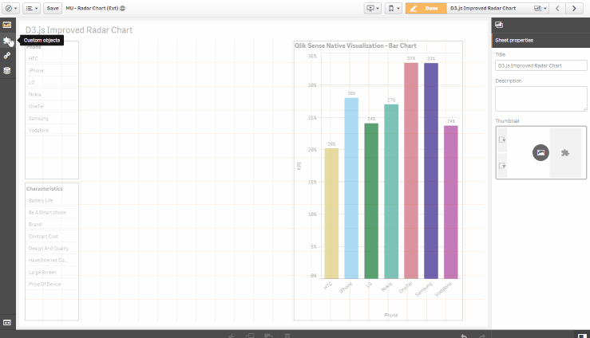

# Interactive Radar Chart

Developed by Brian Booden & Matthieu Burel, based on D3.js

# Update 05/10/2016

- Added support for 10k points, previously was limited to 50
- Simplified Dimensions by adding 2 mandatory, instead of 1 mandatory and 1 optional, which was confusing
- Reworked, simpler color schemes
- Tweaks to label sizes, radar positioning and margins, and legend spacing, to make best use of space

Please try the new version, and leave feedback, as we endeavour to improve our extension!

Regards,
Brian and Matt

Qlik Sense extension displaying multivariate data in the form of a two-dimensional chart of three or more quantitative variables represented on axes starting from the same point: http://en.wikipedia.org/wiki/Radar_chart

# Acknowledgements
The extension is based on and/or inspired by :

> - **Original radar chart extension**, developed by **Borja Rodriguez** :  [here](http://bit.ly/QlikSenseRadarChart_by_BrianMunz)
> - **D3.js**, using by **Nadieh Bremer** to design alternative radar chart look & feel :  [here](http://bit.ly/AlternativeRadarChartLookAndFeel_by_NadiehBremer)
> - **Susie Lu's legend maker** [here](http://bit.ly/D3LegendJS_by_SusieLu)
> - **Chroma.js**, **Gregor Aisch**'s color palette generator : [here](http://bit.ly/ChromaJS_by_GregorAisch)

# Installation

1. Download the extension zip, `qlik-radar-chart_<version>.zip`, from the latest release(https://github.com/qlik-oss/D3ImprovedRadarChart/releases/latest)
2. Install the extension:

   a. **Qlik Sense Desktop**: unzip to a directory under [My Documents]/Qlik/Sense/Extensions.

   b. **Qlik Sense Server**: import the zip file in the QMC.

# Developing the extension

If you want to do code changes to the extension follow these simple steps to get going.

1. Get Qlik Sense Desktop
1. Create a new app and add the extension to a sheet.
2. Clone the repository
3. Run `npm install`
4. Set the environment variable `BUILD_PATH` to your extensions directory. It will be something like `C:/Users/<user>/Documents/Qlik/Sense/Extensions/<extension_name>`.
5. You now have two options. Either run the watch task or the build task. They are explained below. Both of them default to development mode but can be run in production by setting `NODE_ENV=production` before running the npm task.

   a. **Watch**: `npm run watch`. This will start a watcher which will rebuild the extension and output all needed files to the `buildFolder` for each code change you make. See your changes directly in your Qlik Sense app.

   b. **Build**: `npm run build`. If you want to build the extension package. The output zip-file can be found in the `buildFolder`.

# Original authors

[github.com/brianbooden](https://github.com/brianbooden/)
[https://github.com/VizMatt](https://github.com/VizMatt)

# License

Copyright © 2015 Brian Booden & Matthieu Burel

Released under the MIT License